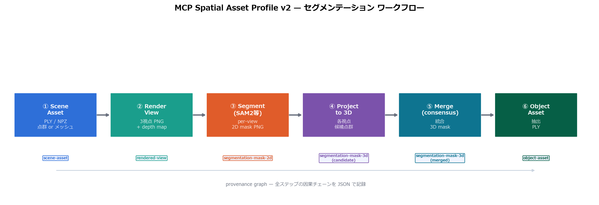

# MCP Spatial Asset Profile v2

[](https://github.com/furuse-kazufumi/mcp-spatial-asset-profile/actions/workflows/ci.yml)
[](LICENSE)
[](#プロジェクトステータス)
[](spec/spatial-asset-profile-v2.md)

**言語 / Languages / 语言:** [English](README.md) · **日本語** · [简体中文](README.zh-CN.md) · [한국어 (요약)](docs/i18n/README.ko.md) · [Español (resumen)](docs/i18n/README.es.md) · [Français (résumé)](docs/i18n/README.fr.md)

---

**MCP Spatial Asset Profile Version 2.0**（本リポジトリでは **MCP Spatial Asset Profile v2** と表記）は、[Model Context Protocol (MCP)](https://modelcontextprotocol.io/) ツールエコシステムにおいて 3D・空間データ資産を表現するための JSON ベースのエンベロープ形式です。

本仕様は **[mcp-3d v1](https://github.com/puruyan2525/mcp-3d)**（Claude Code、2025年4月）を基盤とし、**厳密に追加的（additive）** に拡張されています。すべての v1 アセットは情報損失なく v2 にアップグレード可能で、v2 では完全な来歴トレースを備えたセグメンテーションワークフローが第一級でサポートされます。

## プロジェクトステータス

> **Proof of Concept（PoC）** — 仕様および参照 SDK（Python・TypeScript）はプロトタイピングおよび相互運用実験に利用可能な段階です。フォーマットはまだ凍結されておらず、v2.1 確定前に実 MCP 統合からのフィードバックを歓迎しています。

| 構成要素 | ステータス |
|---|---|
| 仕様（`spec/spatial-asset-profile-v2.md`） | ドラフト、完成 |
| JSON Schema（Draft 2020-12） | 全 8 アセット種別について完成 |
| Python SDK | リファレンス実装、テスト済 |
| TypeScript SDK | リファレンス実装、テスト済 |
| サンプル資産・SDK 間相互運用 | `tests/` でカバー |

**パッケージとリリース**

- PyPI: [`mcp-spatial-asset-profile`](https://pypi.org/project/mcp-spatial-asset-profile/) *(公開準備済み・初回リリース予定)*
- npm: [`@furuse-kazufumi/mcp-spatial-asset-profile`](https://www.npmjs.com/package/@furuse-kazufumi/mcp-spatial-asset-profile) *(公開準備済み・初回リリース予定)*
- GitHub リリース: [`v0.1.0-poc`](https://github.com/furuse-kazufumi/mcp-spatial-asset-profile/releases/tag/v0.1.0-poc)
- 公開手順: [`docs/package-publication.md`](docs/package-publication.md)

---

## このプロファイルとは

MCP Spatial Asset Profile v2 は、MCP 対応ツール同士が 3D・空間データを受け渡す際の **エンベロープ（メタデータ層）** です。実際の重い実体（ポイントクラウド、メッシュ、スプラット、マスク等）は URI の先に置き、プロファイルはそれを **発見・解釈・追跡** するための情報のみを保持します。

v2 は v1 コアに対して以下を追加します。

- **グローバルに安定した `asset_id`** — URN ベース、パイプラインを跨いでも安定。
- **正式な `spatial` ブロック** — 座標 `frame`、`axis`、`handedness`、`unit`、`bounds` を一箇所に集約。
- **viewpoints**（カメラの内部・外部パラメータ）— レンダリングおよび投影に使用。
- **URI ケイパビリティ・ネゴシエーション** — クライアントは実際に消費可能な最良の表現を選択可能。
- **第一級のセグメンテーションワークフロー** — `rendered-view` → `segmentation-mask-2d` → `segmentation-mask-3d` → `object-asset` を `derived_from` と `workflow.target_asset_id` で連鎖。
- **完全なアセットグラフのトレーサビリティ** — 派生アセットはすべて系譜を保持。

---

## サポートされるアセット種別

| 種別（`kind` 値） | 説明 |
|---|---|
| `point-cloud` | 3D 点群（PLY、PCD、LAS、NPY） |
| `mesh` | ポリゴンサーフェスメッシュ（OBJ、glTF、GLB） |
| `gaussian-splat` | 3D Gaussian Splatting シーン |
| `depth-image` | 2D デプス／レンジ画像（16-bit PNG、EXR） |
| `rendered-view` | 視点からの RGB / RGB-D レンダー *(v2 新規)* |
| `segmentation-mask-2d` | 画素単位のセグメンテーションマスク *(v2 新規)* |
| `segmentation-mask-3d` | 点・面単位の 3D ラベル *(v2 新規)* |
| `object-asset` | 抽出されたセグメンテーション済オブジェクトインスタンス *(v2 新規)* |

すべての種別は同一のエンベロープを共有し、提供する `representations` と種別固有フィールドのみが異なります。

---

## セグメンテーションワークフロー



スキーマ構造図・表現形式比較・セグメンテーション結果などの解説図は
[`docs/slides-v2.md`](docs/slides-v2.md) と
[`docs/assets/slides/`](docs/assets/slides/) を参照してください。

```
ソース（point-cloud / mesh / gaussian-splat）
    │  render
    ▼
rendered-view
    │  segment_2d
    ▼
segmentation-mask-2d
    │  lift_3d
    ▼
segmentation-mask-3d
    │  extract_object
    ▼
object-asset
```

各ステップは独立した v2 アセットとなり、来歴は次の 2 経路で保持されます。

- `derived_from` — 直接の親アセット。
- `workflow.target_asset_id` — チェーン全体が最終的にセグメンテーションする **元アセット**。

この設計は **マルチビュー・セグメンテーション** を見据えており、複数の `rendered-view` / `segmentation-mask-2d` を一つの共有 `segmentation-mask-3d` にリフトしつつ、中間ステップを個別に検査可能とします。

---

## リポジトリ構成

```
mcp-spatial-asset-profile/
├── README.md                       ← 英語ランディング
├── README.ja.md                    ← このファイル（日本語）
├── README.zh-CN.md                 ← 简体中文版
├── docs/
│   ├── i18n/                       ← 簡易サマリ（KO / ES / FR）
│   ├── implementation-plan-v2.md
│   ├── reference-architecture-v2.md
│   ├── migration-from-v1.md
│   ├── publication-plan-v2.md
│   └── slides-v2.md
├── spec/
│   ├── spatial-asset-profile-v2.md       ← v2 コア仕様
│   ├── segmentation-workflow-v2.md       ← セグメンテーション拡張
│   ├── schema/                           ← JSON Schema（Draft 2020-12）
│   └── examples/                         ← 標準サンプルアセット
├── sdk/
│   ├── python/                     ← Python SDK（`spatial-asset-v2`）
│   └── typescript/                 ← TypeScript SDK（`spatial-asset-v2`）
├── samples/                        ← サンプルペイロード（v1 から継承）
└── tests/                          ← スキーマ・ラウンドトリップ・相互運用テスト
```

---

## クイックスタート

### JSON Schema 単体で利用

スキーマは任意の JSON Schema 2020-12 バリデータ（`ajv`、`jsonschema` 等）で単体利用できます。

```bash
# spec/schema/asset.schema.json がマスタースキーマ
# spec/examples/*.json が標準インスタンス
```

### Python SDK

PyPI 配布名は **[`mcp-spatial-asset-profile`](https://pypi.org/project/mcp-spatial-asset-profile/)** です（インポートは従来どおり `spatial_asset_v2`）。

```bash
# PyPI 公開後:
pip install mcp-spatial-asset-profile
# JSON Schema 検証を有効化:
pip install "mcp-spatial-asset-profile[validate]"
```

リポジトリのソースから利用する場合:

```bash
cd sdk/python
pip install -e ".[dev]"

# サンプルアセットの検証
python -m spatial_asset_v2.cli.main validate ../../spec/examples/pointcloud-asset.json

# サンプルアセットの生成
python -m spatial_asset_v2.cli.main generate --output /tmp/samples

# モックセグメンテーションパイプラインの実行
python -m spatial_asset_v2.cli.main workflow \
  --source ../../spec/examples/pointcloud-asset.json \
  --output /tmp/pipeline

# テスト実行
pytest tests/ -v
```

### TypeScript SDK

npm 配布名は **[`@furuse-kazufumi/mcp-spatial-asset-profile`](https://www.npmjs.com/package/@furuse-kazufumi/mcp-spatial-asset-profile)** です。

```bash
# npm 公開後:
npm install @furuse-kazufumi/mcp-spatial-asset-profile
```

リポジトリのソースから利用する場合:

```bash
cd sdk/typescript
npm install
npm run build
npm test
```

公開手順の詳細は [`docs/package-publication.md`](docs/package-publication.md) を参照してください。

---

## 検証と CI

GitHub Actions（`.github/workflows/ci.yml`）は `main` への push および pull request ごとに以下を実行します。

- **Python SDK & リポジトリテスト** — Python 3.11 / 3.12、`pytest` による SDK ユニットテストおよびリポジトリレベルのスキーマ／ラウンドトリップ／相互運用テスト。
- **TypeScript SDK** — Node.js 20、`npm run build` と `npm test`。

同じチェックはローカルでも実行できます（上記「クイックスタート」参照）。README 上部の CI バッジは `main` の現在の状態を反映します。

---

## v1 との互換性

v2 は v1 の **厳密な上位集合** であり、移行は機械的に行えます。

| v1 | v2 | 移行 |
|---|---|---|
| `id` | `asset_id` | フィールドリネーム |
| `crs` | `spatial.frame` | `spatial` ブロックへ移動 |
| `bounds` | `spatial.bounds` | `spatial` ブロックへ移動 |
| `version: "1.0"` | `version: "2.0"` | バージョン文字列の更新 |

両 SDK はパース時に v1 アセットを自動マイグレートします。詳細は [`docs/migration-from-v1.md`](docs/migration-from-v1.md) を参照してください。

---

## ロードマップ

PoC 後の短期優先項目です。

1. **マルチビュー・セグメンテーションワークフロー** — N 個の `rendered-view` から単一の共有 `segmentation-mask-3d` へリフトする手順を正式化。
2. **ケイパビリティ語彙レジストリ** — 表現 `capabilities` の共有語彙を整備し、独立ツール間でアドホック文字列なしに相互運用可能とする。
3. **ストリーミング表現** — タイル化／プログレッシブなペイロード（Cesium 3D Tiles、Potree、splat タイル）をエンベロープ内で記述。
4. **リファレンスビューアアダプタ** — TypeScript アダプタインタフェースを使う最小ブラウザビューアにより、エンドツーエンドのデモを可能に。
5. **v2.1 仕様凍結** — 外部統合からのフィードバックでフォーマットが安定した時点で実施。

[`docs/implementation-plan-v2.md`](docs/implementation-plan-v2.md) および [`docs/publication-plan-v2.md`](docs/publication-plan-v2.md) も参照してください。

---

## コントリビューション

本プロジェクトはオープンな Proof of Concept であり、貢献を歓迎します。特に次の領域でのフィードバックが有用です。

- エンベロープのギャップを露わにする実利用統合。
- スキーマの修正、新規アセット種別、ケイパビリティ語彙の提案。
- 翻訳およびドキュメント改善（README 上部の言語ナビゲーション参照）。

最初に以下をご覧ください。

- **[CONTRIBUTING.md](CONTRIBUTING.md)** — 変更の提案方法、テスト実行、仕様 / スキーマ / サンプル / SDK の同期について。
- **[行動規範（Code of Conduct）](CODE_OF_CONDUCT.md)** — コミュニティ基準。
- **[GitHub Discussions](https://github.com/furuse-kazufumi/mcp-spatial-asset-profile/discussions)** — 質問、アイデア、初期段階の仕様提案、実装報告、i18n の相談。日本語の投稿も歓迎します。
- **[docs/community.md](docs/community.md)** — どの会話をどこで行うか、および仕様提案の進め方。

仕様（`spec/`）に関わる大きな変更は、まず Discussion または `[spec]` Issue で方向性を合意してから PR を出していただけると助かります。

---

## ライセンス

MIT — [LICENSE](LICENSE) を参照してください。

---

## 来歴

本プロジェクトは [@puruyan2525](https://github.com/puruyan2525) による **[mcp-3d v1](https://github.com/puruyan2525/mcp-3d)**（Claude Code（Anthropic）、2025年4月）を基盤としています。v2 はその v1 コアにセグメンテーションワークフロー、より豊かな空間メタデータ、参照 SDK を追加するものです。
