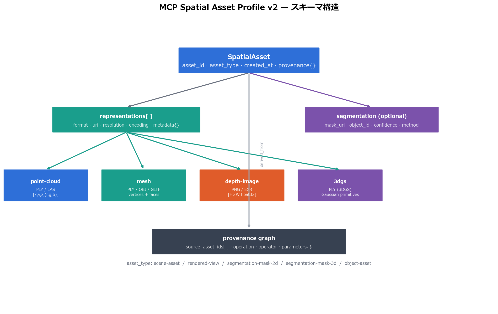
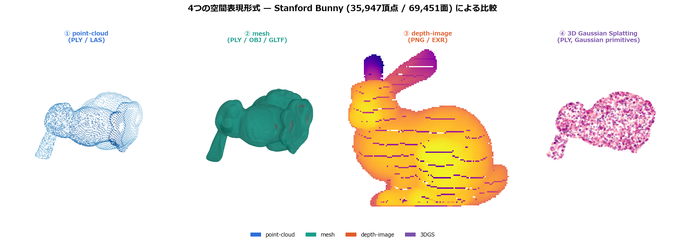
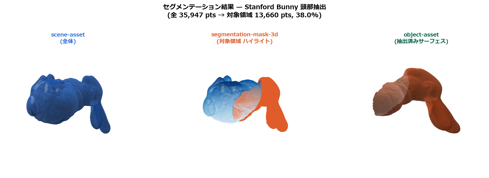

# MCP Spatial Asset Profile v2
## Proof of Concept

**Version 2.0.0 — May 2025**

Built on: mcp-3d v1 (puruyan2525, April 2025)

---

## Motivation

3D/spatial data is increasingly central to AI pipelines:
- Point clouds from LiDAR sensors
- Meshes from photogrammetry
- Gaussian Splats from NeRF-successors
- Segmentation masks from foundation models (SAM2, etc.)

**Problem:** No standard envelope for MCP tools to exchange spatial assets.

**Solution:** MCP Spatial Asset Profile — a minimal JSON envelope.

---

## What's New in v2

| Feature | v1 | v2 |
|---|---|---|
| Asset identity | `id` (optional) | `asset_id` (URN, required) |
| Spatial metadata | top-level `crs`, `bounds` | `spatial` block (frame, axis, unit, bounds) |
| Segmentation | ❌ | 4 new kinds + workflow model |
| Viewpoints | ❌ | `viewpoints[]` with intrinsics/extrinsics |
| Traceability | ❌ | `derived_from` + `workflow.target_asset_id` |
| Capability negotiation | `capabilities_required` | full capability token registry |
| Render hints | ❌ | `render_hints` block |

---

## Asset Model (v2)



```json
{
  "version": "2.0",
  "asset_id": "urn:uuid:550e8400-...",
  "kind": "point-cloud",
  "representations": [
    { "format": "ply", "uri": "bunny.ply", "point_count": 35947 }
  ],
  "spatial": { "unit": "m", "up_axis": "+Y", "bounds": {...} },
  "viewpoints": [{ "viewpoint_id": "vp-front", "fov_y_deg": 45 }],
  "render_hints": { "point_size": 2.0 },
  "derived_from": []
}
```

---

## 8 Asset Kinds




**Core (v1 + v2):**
- `point-cloud` — PLY, PCD, LAS, NPY
- `mesh` — OBJ, glTF, GLB
- `gaussian-splat` — .splat, PLY with Gaussian channels
- `depth-image` — 16-bit PNG depth map

**New in v2 (segmentation workflow):**
- `rendered-view` — RGB render from a viewpoint
- `segmentation-mask-2d` — Pixel-level label map
- `segmentation-mask-3d` — Per-point label array
- `object-asset` — Extracted object instance

---

## Segmentation Pipeline


```
Source (point-cloud)
  │
  ├─[render]──────────────→ rendered-view
  │                              │
  │                         [segment_2d]
  │                              │
  │                    segmentation-mask-2d
  │                              │
  ├─[lift_to_3d]────────────────→┤
  │                              │
  │               segmentation-mask-3d
  │                              │
  └─[extract_object]────────────→┘
                         object-asset
```

Every step → new asset_id, full `derived_from` provenance.

---

## Traceability Graph



```
urn:uuid:bunny-pc-001          (point-cloud)
  └─ urn:uuid:rv-001           (rendered-view)
       └─ urn:uuid:mask2d-001  (segmentation-mask-2d)
            └─ urn:uuid:mask3d-001  (segmentation-mask-3d)
                 └─ urn:uuid:obj-001  (object-asset)
```

`validate_pipeline(assets)` verifies the full graph:
- No broken references
- No cycles
- Correct kind-to-kind edges

---

## Python SDK

```python
from spatial_asset_v2 import SpatialAsset, Representation
from spatial_asset_v2.workflow import WorkflowMockRunner
from spatial_asset_v2.validators import validate_asset, validate_pipeline

runner = WorkflowMockRunner()
pipeline = runner.run_full_pipeline("urn:uuid:bunny")
# [rendered-view, mask-2d, mask-3d, object-asset]

for asset in pipeline:
    errors = validate_asset(asset)
    assert errors == []
```

---

## TypeScript SDK

```typescript
import { parseAsset, selectRepresentation, validateAsset } from "spatial-asset-v2";

const asset = parseAsset(rawJson);
const rep = selectRepresentation(asset, ["splat-render"]);

const result = validateAsset(rawJson);
// { valid: true, errors: [] }
```

---

## JSON Schema (Draft 2020-12)

7 schemas covering all kinds:

```
spec/schema/
├── asset.schema.json           ← Master schema
├── representation.schema.json
├── viewpoint.schema.json
├── rendered-view.schema.json
├── segmentation-mask-2d.schema.json
├── segmentation-mask-3d.schema.json
└── object-asset.schema.json
```

All 7 example files validate clean against schema.

---

## Test Results (PoC)

| Suite | Tests | Pass |
|---|---|---|
| Python test_models | 12 | 12 ✅ |
| Python test_codec | 22 | 22 ✅ |
| Python test_validators | 16 | 16 ✅ |
| Python test_workflow | 16 | 16 ✅ |
| TypeScript (node:test) | 30 | 30 ✅ |
| **Total** | **96** | **96 ✅** |

---

## Design Principles

1. **Additive only** — v2 extends v1; no removals
2. **Minimal required fields** — only what's needed for tool interop
3. **No heavy deps** — pure JSON; binary payloads are URIs
4. **Agent-friendly** — flat structure, clear field names, ISO dates
5. **Traceability first** — every derived asset knows its parents

---

## Roadmap

| Phase | Target | Key Items |
|---|---|---|
| PoC | ✅ Now | Spec, schemas, SDKs, tests |
| Alpha | Q3 2025 | PyPI/npm publish, MCP server integration |
| Beta | Q4 2025 | Real segmentation backend (SAM2 plugin) |
| GA | Q1 2026 | Stable spec, community governance |

---

## Links

- Repository: `mcp-spatial-asset-profile` (GitHub)
- Based on: `mcp-3d` by @puruyan2525
- Spec: `spec/spatial-asset-profile-v2.md`
- Python SDK: `sdk/python/`
- TypeScript SDK: `sdk/typescript/`

---

# Thank You

**MCP Spatial Asset Profile v2**

*Making spatial data first-class in AI tool ecosystems.*
